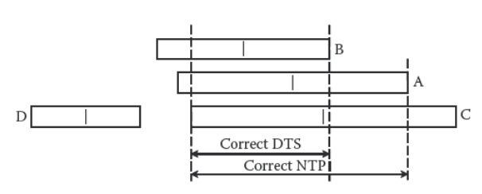

# CSE 237B Lab 1: Time Synchronization

The goal of this lab is to implement a simplified version of NTP time synchronization. First, an initial estimate of clock offset is made using a single ping to a server. Next, an algorithm is implemented which uses several of these "pings" to determine an offset estimate that is more robust to variability in the network environment.

## Part 1: Estimating Clock Offset

The general idea is that, using the four times listed in the figure below, we can estimate the offset between the client's clock and the server's clock.

Using the four timestamps, we can calculate the roundtrip time (RTT) between the client and server as:

RTT = (t\_dst - t\_org) - (t\_xmt - t\_rec)

Under the assumption that the network latency is symmetric (that is, d1 = d2), we can calculate the offset such that t\_s = t\_c + offset as:

offset = 0.5 * [(t\_rec - t\_org) + (t\_xmt - t\_dst)]

However, the assumption that the network latency is asymetric is not necessarily a good assumption. By assuming d1 = 0 or d2 = 0, we can bound the offset as follows:

Bound of offset: [offset - RTT/2, offset + RTT/2]

## Part 2: Refine Clock Estimate using NTP Algorithms

Using only a single "ping" as described previously (or even taking the average of a few pings) leads to a clock offset estimate that can have significant jitter due to instantaneous network loading and any number of other reasons. Thus, it is necessary to apply 

### Selection Algorithm

We first apply a "selection" algorithm which refines the bound of the true clock offset. Given a set of measurements and bounds, the algorithm seeks to find the interval that contains the midpoints of all of the "correct" estimates.

The output of this algorithm is a lower and upper bound for the interval which contains the true clock offset.

### Clustering Algorithm

We must now determine where the offset lies within the interval determined in the previous step. First, we discard all measurements whose midpoints do not lie in the interval. These measurements are deemed to be "incorrect" and are probably due to network jitter.

Next, we apply the "clustering" algorithm to successively remove the measurement which is furthest away from the currently remaining measurements as determined by the metric below. 

We continue to remove measurements until we are left with some MIN number of measurements which are deemed to be the "best".

### Combining Algorithm

Finally, we combine the remaining MIN measurements as follows:

* Initialize y, z = 0
* For each measurement
    * y += 1/lambda
    * z += theta/lambda

The final clock estimate is given by Theta = z/y.

## Implementation and Results

The above algorithms were implemented in Go. For ease of use, the "pings" were done using TCP rather than UDP. While UDP should give more predictable behavior (and thus a better timing estimate), TCP should introduce more jitter and be a better test of the robustness of the algorithm.

A total of 500 time points were collected over the UCSD-PROTECTED wireless network. At each time point, 50 individual pings were performed. The final combining algorithm used the best 15 pings.

In the figure above, the offset, upper, and lower bounds are taken as the average of the 50 pings at each time point. The purple "NTP" points are the result of the NTP filtering algorithm.

The NTP filtering algorithm effectively removed the large spikes seen at ~8 seconds and ~35 seconds. Other smaller errors were not rejected, but these are an order of magnitude smaller than the successfully rejected disturbances.