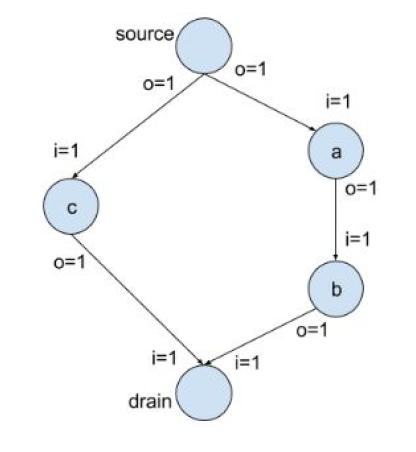
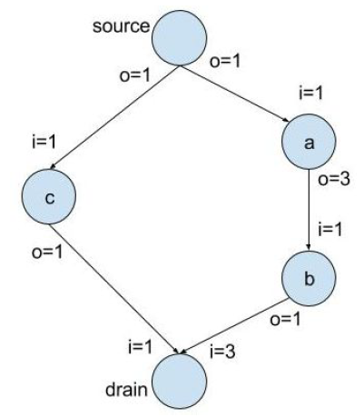

# CSE 237B Lab 2: Programming with Concurrency on Embedded Systems

The goal of this lab is to implement a toy data flow system represented by a directed acyclic graph (DAG) using Goroutines.



The following is a description of the project as given in the lab instructions:

> In the data processing graph, each node stands for an action of data processing. An arrow between two nodes stands for data communication. In this simplified model, the data that passes between nodes is called “Message”. Message has a field “Quantity” that indicates the amount of data. Each node must receive enough amount of data to start processing. In this example, “i=1” between node “source” and node “a” means that “a” must receive enough data from “source” with a total quantity “1” to start processing. After processing, “o=1” means that “a” will produce data with quantity 1 to “b”. “drain” must receive “1” data from “b” and “1” data from “c” to run. 
>
> Dataflows represented as DAG are widely adopted in many applications, from digital signal processing (DSP) to distributed data analytics (e.g. Spark, Storm). In order to fully utilize all parallel computing resource when processing the dataflow, nodes with no dependencies in between should run concurrently, e.g., on different processor cores. For example, node “c” can run in parallel with node “a” or node “b”.

The implementation in this lab will generalize from the above example to support DAGs with arbitrary positive integers as input and output values for each node. To test our implementation, the following DAG will be used. 



## Implementation

The DAG is stored in a json format. The json representation of the graph above can be found [here](./main/config.json).

Each [node](./graph/node.go) in the DAG is implemented as a `goroutine`. Goroutines allow for lightweight parallelization of tasks and simple synchronous or asynchronous message passing. Each edge in the DAG is implemented as a `channel`. 

Each node prints a statement when it receives data from another node. Once it has received all the data that it needs, it prints that it is processing the data, followed by sending its output to its output nodes. 

## Results

Please note that since the goroutines are running in parallel, the order in which some statements are printed to the terminal are nondeterministic. The output of an example execution of the program is as follows:

```
2017/05/18 13:25:12 Start DataFlow
2017/05/18 13:25:12 Create goroutine for node (c)
2017/05/18 13:25:12 Create goroutine for node (drain)
2017/05/18 13:25:12 Create goroutine for node (source)
2017/05/18 13:25:12 Create goroutine for node (a)
2017/05/18 13:25:12 Create goroutine for node (b)
2017/05/18 13:25:12 Node (b): Initiated
2017/05/18 13:25:12 Node (c): Initiated
2017/05/18 13:25:12 Node (drain): Initiated
2017/05/18 13:25:12 Node (source): Initiated
2017/05/18 13:25:12 Node (source): ----- Start processing data -----
2017/05/18 13:25:12 Node (source): Send <1> to (c)
2017/05/18 13:25:12 Node (source): Send <1> to (a)
2017/05/18 13:25:12 Node (c): Receive <1> from (source)
2017/05/18 13:25:12 Node (c): ----- Start processing data -----
2017/05/18 13:25:12 Node (c): Send <1> to (drain)
2017/05/18 13:25:12 Node (drain): Receive <1> from (c)
2017/05/18 13:25:12 Node (a): Initiated
2017/05/18 13:25:12 Node (a): Receive <1> from (source)
2017/05/18 13:25:12 Node (a): ----- Start processing data -----
2017/05/18 13:25:12 Node (a): Send <3> to (b)
2017/05/18 13:25:12 Node (b): Receive <3> from (a)
2017/05/18 13:25:12 Node (b): ----- Start processing data -----
2017/05/18 13:25:12 Node (b): Send <1> to (drain)
2017/05/18 13:25:12 Node (b): ----- Start processing data -----
2017/05/18 13:25:12 Node (b): Send <1> to (drain)
2017/05/18 13:25:12 Node (b): ----- Start processing data -----
2017/05/18 13:25:12 Node (b): Send <1> to (drain)
2017/05/18 13:25:12 Node (drain): Receive <1> from (b)
2017/05/18 13:25:12 Node (drain): Receive <1> from (b)
2017/05/18 13:25:12 Node (drain): Receive <1> from (b)
2017/05/18 13:25:12 Node (drain): ----- Start processing data -----
2017/05/18 13:25:12 Graph processing ends
```


