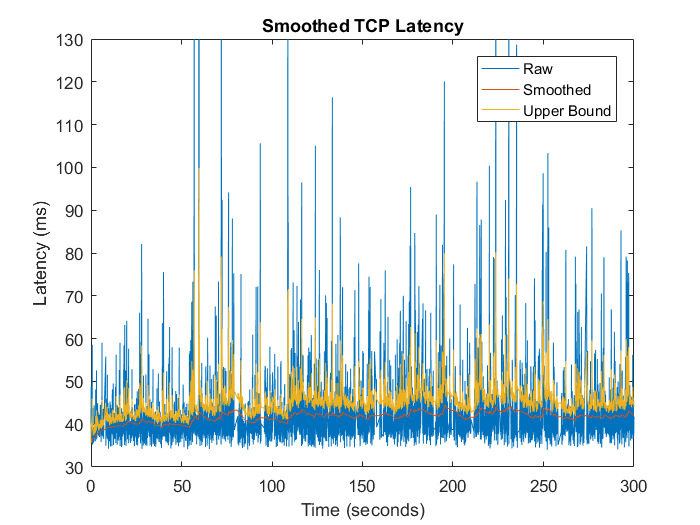
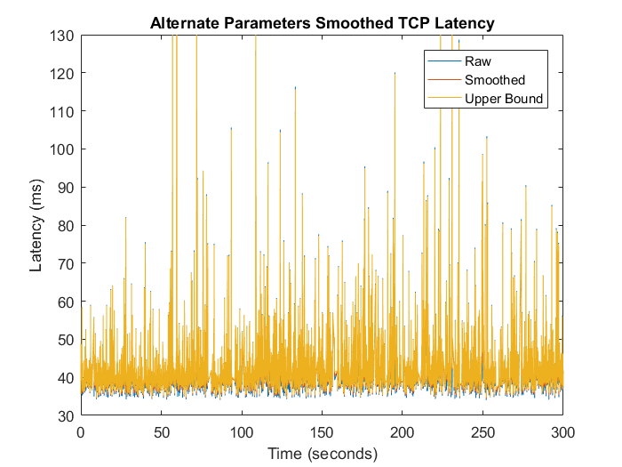

# CSE 237B Final Project: Measuring and Estimating Wireless Network Latency

## Task 1: Measuring Wireless Network Latency

We want to establish a framework to measure the network latency between a Raspberry Pi and a laptop. The first thing we must do in order to do this is establish a synchronized clock between the two machines. A minimally modified version of the code from Lab 1 is employed.

The code from Lab 1 writes both the current time and the measured offset to a file. The current time enables the image client to determine if the synchronization is stale or if it is recent enough to be valid.

The image client first attempts to `mmap` the file with the time synchronization offset and determine if the sync is valid. If the syncronization is valid, it continuously downloads an image from the image server and measures the latency over the course of five minutes.

To send an image, I modified an http server from [http://www.sanarias.com/blog/1214PlayingwithimagesinHTTPresponseingolang](http://www.sanarias.com/blog/1214PlayingwithimagesinHTTPresponseingolang). The server is setup to send a 2040x2040 jpeg image of a red square. The server also sends the beginning transmission time as part of the html body. 

The image client receives the entire html page and extracts the time the server sent the message from the body. By applying the offset found earlier, the client can determine how long it took to send the image (the latency).

## Task 2: Estimating Wireless Network Latency

The latency measured in the previous part is not smooth; it is full of spikes when latency increases. We wish to make a smoother estimate of latency using the following algorithm.

Let $y_i$ be the measured sample, $y^s$ be the smoothed estimated latency, $y^{var}$ be the estimated variance, and $y^{up}$ be an upper bound on the smoothed estimate. Then,

$$ y^{var} = (1 - \beta) y^{var} + \beta \mid y^s - y_i \mid $$

$$ y^s = (1 - \alpha) y^s + \alpha y_i $$

$$ y^{up} = y^s + \kappa y^{var} $$

Clearly, $\beta​$ affects how sensitive the smoothed estimate's variance is to new samples: if $\beta​$ is small, the variance is stable throughout the estimate and places less emphasis on new data. Likewise for $\alpha​$. The $\kappa​$ parameter lets us decide how tight of an upper bound we want on our data. Small $\kappa​$ means that we have a very tight upper bound which may or may not be meaningful.

In Figure 1, we see the results of semi-optimized smoothing parameters during an online estimate. For this plot, $\alpha = 0.01$, $\beta = 0.$4, $\kappa = 0.8$. The smoothed estimate is 

Using MATLAB, we can explore how alternate smoothing parameters affect the same data. For example, in the plot below, we let $\alpha = 0.9$, $\beta = 0.9$, $\kappa = 0.1$. Clearly, this does not smooth the latency estimate at all!

